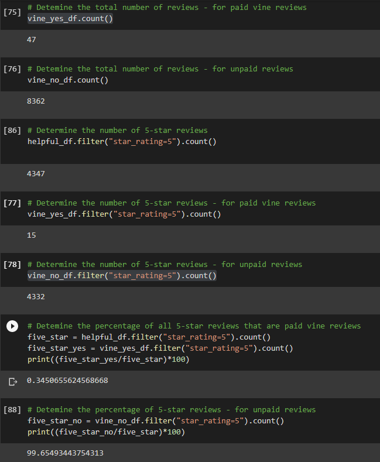

# Amazon_Vine_Analysis

# Overview - Amazon Vine Program

The Amazon Vine program is a service that allows manufacturers and publishers to receive reviews for their products. Companies like SellBy pay a small fee to Amazon and provide products to Amazon Vine members, who are then required to publish a review. The main question we want to answer with this analysis is whether SellBy should look to enroll in the Vine program, and if its worth the cost. 

There are approximately 50 datasets available, which contain reviews of a specific category of products. The watches dataset was chosen to perform a cloud ETL process using Google Colab Notebook.

We will be using PySpark in conjunction with Google Colab Notebook to perform the ETL process to extract the dataset, transform the data, connect to an AWS RDS instance, and load the transformed data into pgAdmin. With this, we hope to determine if there is any bias towards favorable reviews from Vine members in the watches dataset

# Results

We were able to load our dataset into our AWS RDS instance and query our data in pgAdmin:

### Figure 1 - Customer Review Frequency 
</img>

### Figure 2 - Products Table 
</img>

### Figure 3 - Review ID Detail 
</img>

### Figure 4 - Vine Table
</img>

### Figure 5 - Analysis Summary 
</img>

To ensure we only include reviews that are more likely to be helpful and avoid having division by zero errors later on, we only included reviews that are equal or greater than 20. In addition to this, only reviews that showed a helpfulness percentage equal or greater than 50% were chosen as these reviews would be most impactful and significant.

With these conditions in mind, the outcome of analysis on the dataset for watches sold addressed the following:

- There were a total of 47 Vine reviews, and 8362 non-Vine reviews
- Out of 4347 5-star reviews: 15 were Vine reviews, and 4332 were non-Vine reviews
- Resulting in 0.35% of 5-star reviews coming from Vine, and 99.65% of 5-star reviews coming from non-Vine reviews

# Summary

With all incentivized reviews, there is a potential of 'positivity bias' which refers to where reviews are more inclined to give products positive feedback for receiving free or discounted products. 

Based on the above results focused on 5-star reviews, only a small fraction of overall 5-star reviews have shown to be from paid Vine reviews - 0.35%. In total there were only 47 out of the total 8409 reviews that involved influential Vine reviews (refer to [Figure 5](#-Figure-5---Analysis-Summary)). With such a small amount of Vine reviewers, it can be said that in our dataset there is no positivity bias.

To further improve on the analysis, a filter on reviews for those that have verified purchases. This is to ensure that reviewers of the product have actually purchased them, giving more validity to their review and score.

Statistical summary analysis and Hypothesis testing can be done to see whether this outcome was mainly due to chance.